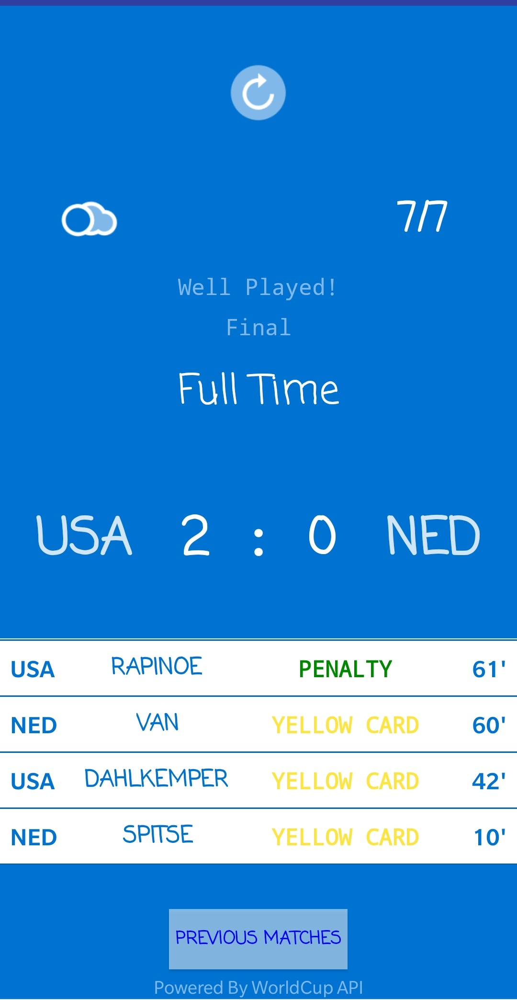
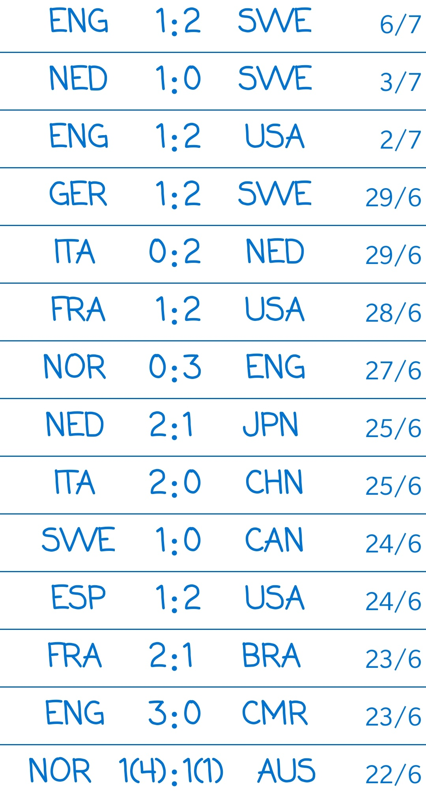

# FootballLive
An android application for the FIFA WorldCup 2018, where the user can see live match updates and the results of the previous matches.
# Compilation
Download the source code and run it on Android Studio. Wait for 3-4 seconds before hitting refresh.
# Description
The app has two parts: one showing the current game updates and previous match scores.

The first part displays all details like stage, status (time, half-time or full time), weather, date, scores, and events which occured during that match. The following is an example:

The second part displays all match scores of the previous matches. Here's a look:

# Future Implementations
1. Will be adding stats about the previous matches too.
2. Will add players playing and substitutions taking place in the match.
3. UI improvements.
